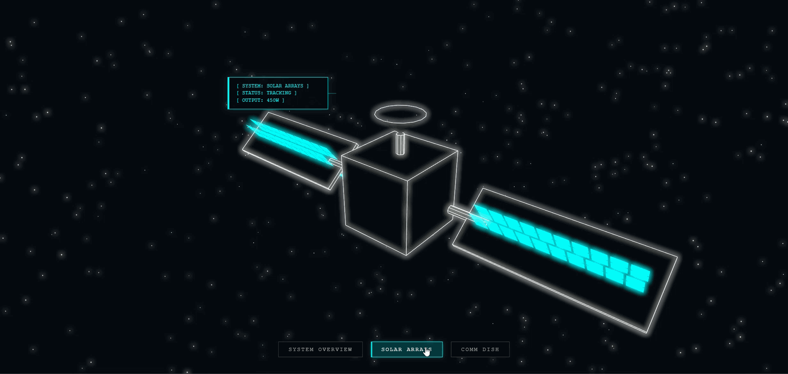
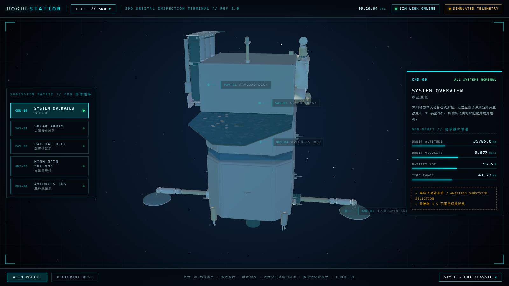
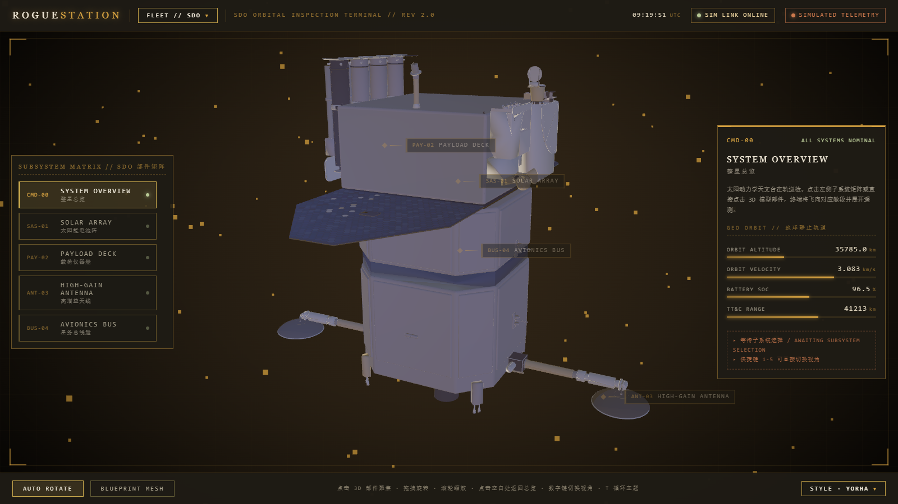
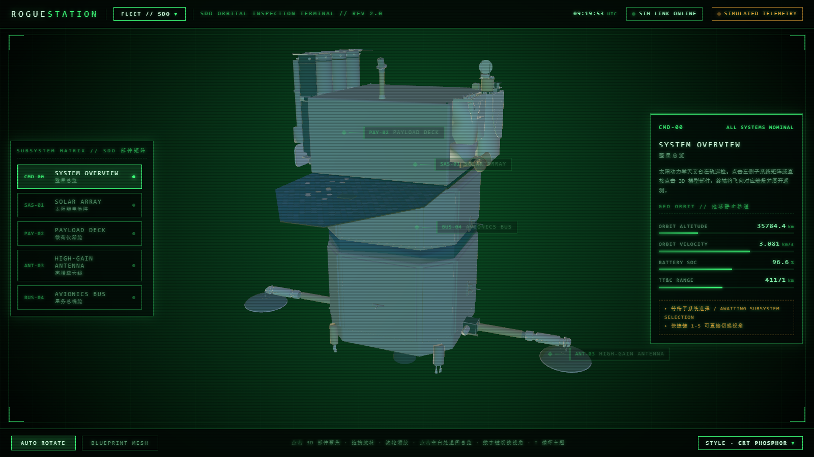
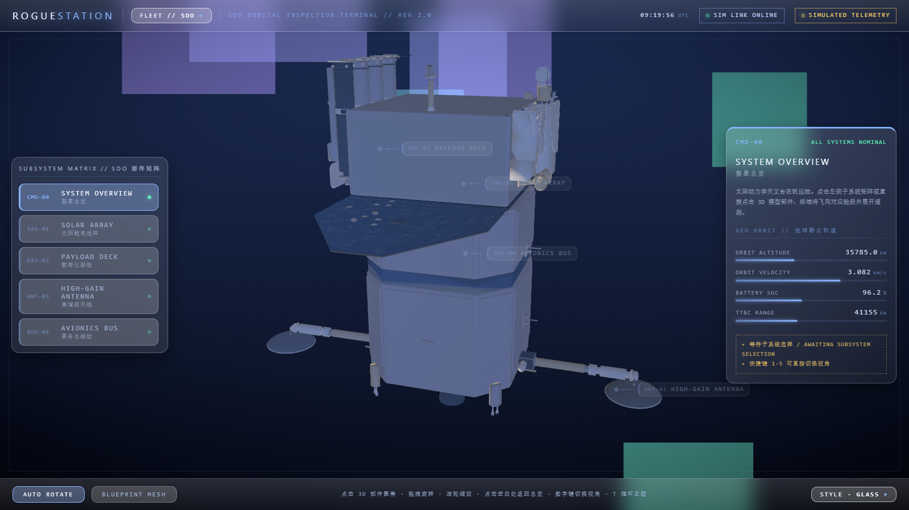
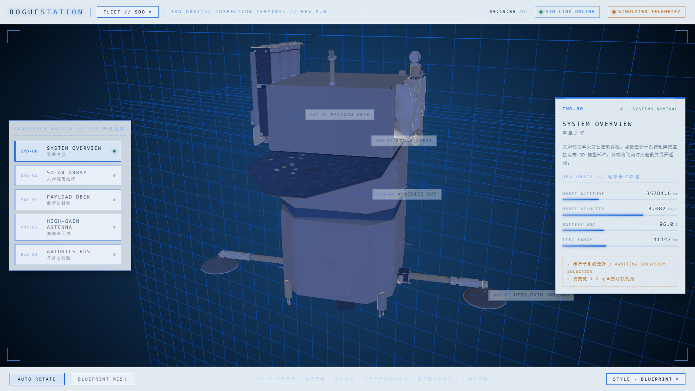
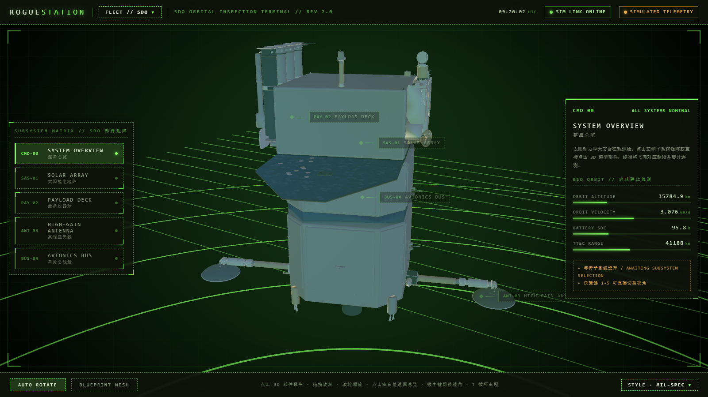
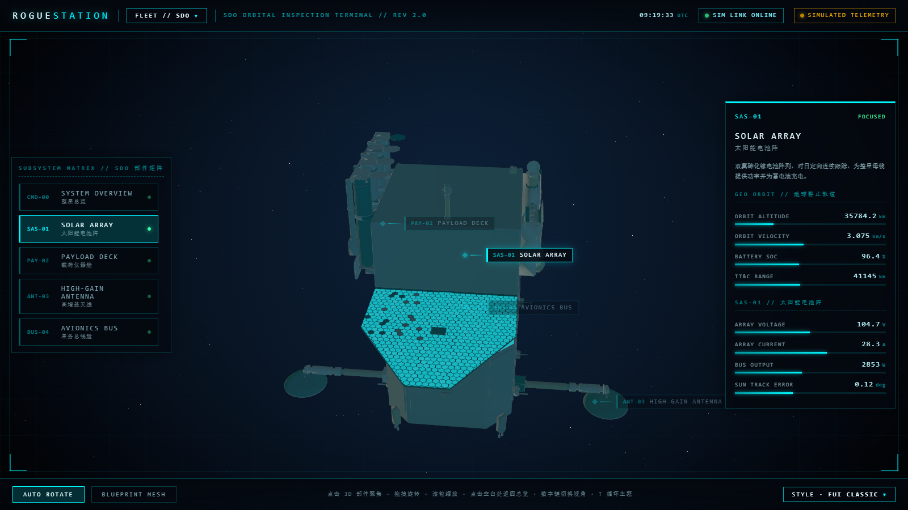
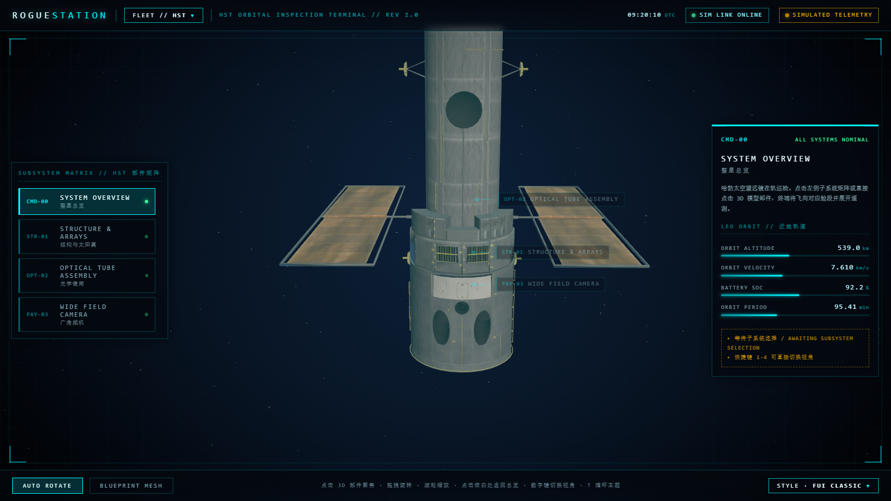

# ORBITAL DECK (轨道甲板) 🛰️

[English Version](./README.md)

**全保真 3D 卫星可视化与巡检平台。**

ORBITAL DECK 是一套基于 WebGL 的交互式可视化系统，采用 React 和 Three.js 构建。它融合了工业级未来主义（FUI）美学，包含高精度的 3D 模型、流畅的摄像机转场以及动态数据覆盖层。



## 截图

**6 套界面主题**——每套都是完整视觉重设计，且拥有专属 3D 背景：

| FUI 经典 | YoRHa |
| :---: | :---: |
|  |  |

| CRT 荧光 | 玻璃拟态 |
| :---: | :---: |
|  |  |

| 蓝图 | 军规雷达 |
| :---: | :---: |
|  |  |

**巡检视角**——分系统聚焦（其余部件压暗）与机队切换（哈勃）：

| 分系统聚焦 | 机队 · HST |
| :---: | :---: |
|  |  |

## 核心特性

- **统一驾驶舱版式**：通栏顶栏（Logo · FLEET 下拉 · 时钟/徽标）与通栏底条（开关 · 提示 · STYLE 下拉），子系统矩阵面板化为左侧导轨，3D 舞台四角带 1px 取景框刻线。
- **6 款真实航天器机队**：顶栏 FLEET 下拉可切换 NASA 3D Resources 资产——SDO、哈勃（HST）、TDRS、GOES、SOHO 与 SSL-1300 通信卫星平台；所有模型自动归一化到统一的相机尺度。
- **6 套界面风格主题**：底栏 STYLE 下拉选择（或 `T` 键循环）——FUI 经典、YoRHa 工业终端（沙色炭黑平面面板）、CRT 荧光（扫描线+辉光）、玻璃拟态（磨砂圆角面板）、蓝图浅色（图纸纸质 UI）、军规雷达（虚线边框+角标括号）。每种主题都是完整的视觉重设计而非单纯换色——面板形状、边框语言、材质与装饰同步切换，选择跨刷新持久保存。
- **主题化 3D 背景**：背景不再绑定星空——每个主题拥有专属渐变天空与背景层：漂移星场（FUI）、暖琥珀尘埃（YoRHa）、荧光暗底（CRT）、极光散景（Glass）、工程网格地板/背墙（Blueprint）、带旋转扫描线的雷达界面（Mil-Spec）。
- **部件级巡检**：直接点击 3D 模型部件（射线拾取）或使用左侧子系统矩阵，摄像机将飞向对应舱段，其余部件自动压暗，目标部件青色辉光脉冲。子系统按各模型的 GLB 材质名自动分类。
- **几何体锚定的相机枢轴**：轨道中心取部件顶点均值质心（质心悬空时自动吸附到最近的真实顶点），旋转视角始终围绕你看到的部件，而不是悬浮的标签节点。
- **拖拽安全手势**：拖拽旋转后落在空白处的松手动作不再被判定为"点击空白返回总览"，手动视角不会被重置。
- **实时 FUI 遥测**：按模型区分的模拟遥测/轨道数据（地球静止轨道 / 近地轨道 / 日地 L1 点……），带动态条形图、分系统指标栈与锚定式 HUD 标记。
- **蓝图模式**：一键将整星切换为经典线框全息外观。
- **电影级转场**：GSAP + OrbitControls 协同的平滑摄像机编排；聚焦时模型缓动回标准朝向。
- **启动序列**：带 Draco 解码进度的加载屏幕，切换机队时自动重新武装。
- **后期处理**：主题渐变天空之上的 Bloom 与暗角效果。

## 技术栈

- **前端框架**: [React 19](https://react.dev/)
- **3D 引擎**: [Three.js](https://threejs.org/) (通过 [@react-three/fiber](https://github.com/pmndrs/react-three-fiber))
- **组件库**: [@react-three/drei](https://github.com/pmndrs/drei)
- **动画库**: [GSAP](https://greensock.com/gsap/)
- **样式方案**: [Styled-components](https://styled-components.com/)
- **构建工具**: [Vite](https://vitejs.dev/)
- **后期处理**: [@react-three/postprocessing](https://github.com/pmndrs/react-postprocessing)

## 快速上手

### 环境准备

- [Node.js](https://nodejs.org/) (v18 或更高版本)
- npm 或 yarn

### 安装步骤

1. 克隆仓库：
   ```bash
   git clone https://github.com/MrmoLabs/orbital-deck.git
   cd orbital-deck
   ```

2. 安装依赖：
   ```bash
   npm install
   ```

3. 启动开发服务器：
   ```bash
   npm run dev
   ```

4. （可选）无头冒烟测试——需要本机 Chrome 且开发服务器已启动：
   ```bash
   npm run smoke
   ```

## 项目结构

- `public/models/`：6 个 NASA glTF 资产（SDO、HST、TDRS、GOES、SOHO、SSL-1300，按需 Draco 压缩）。
- `public/draco/`：本地内置的 Draco 解码器（不依赖外网 CDN）。
- `docs/`：README 截图（各主题画廊、巡检视角）。
- `src/styles/`：样式拆分——`base.css`（默认令牌 + 元素基础）、`themes.css`（各主题令牌覆盖）、`decorations.css`（CRT 扫描线、军规角标），由 `index.css` 汇总引入。
- `src/lib/`：领域逻辑。
  - `fleet/`：机队注册表——`types.ts`（领域类型 + 通用助手）、`models/`（每颗航天器一个文件：子系统划分规则、相机取向、遥测通道）、`index.ts`（FLEET 组装）。
  - `parts/`：`analysis.ts`（分系统表面吸附枢轴、尺度归一化）+ `framing.ts`（相机取景）。
  - `themes.ts`：页面主题注册表——6 种界面风格（配色 + 面板/边框/材质令牌、场景渐变色、背景层类型）、下拉标签、持久化。
  - `telemetry.ts`：模拟遥测随机游走。
  - `dragGuard.ts`：区分轨道拖拽与真实点击。
- `src/scene/`：3D 层。
  - `Experience.tsx`：Canvas、灯光阵列、渐变天空、后期处理（经 `React.lazy` 懒加载，HUD 先行绘制）。
  - `backdrops/`：按主题的场景背景——`Sky`（渐变贴图）、`Particles`（尘埃/极光）、`Geometry`（工程网格/雷达界面）、`Backdrop`（类型开关）。
  - `SatelliteScene.tsx`：模型渲染、分系统高亮/压暗、射线拾取。
  - `CameraRig.tsx`：GSAP 摄像机编排。
  - `PartMarker.tsx`：锚定式 HUD 标记。
- `src/ui/`：HUD 层（顶栏机队下拉、左侧子系统导轨、遥测面板、底条样式下拉、下拉原语、启动屏）。
- `scripts/smoke-test.mjs`：无头 Chrome 冒烟测试（覆盖两个下拉、全部 6 主题/5 机队模型 + 拖拽守卫回归）。
- `scripts/capture-readme.mjs`：录制 hero 动图——脚本化巡览期间用 Chrome screencast 抓帧，ffmpeg 编码（`npm run capture`）。

## 打包拆分

Vite `manualChunks` 拆分 vendor（`three` / `react` / `gsap`），3D 层动态导入：首屏仅需 HUD 外壳（约 85 kB gzip），3D 引擎在启动屏后按需流入。

## 3D 模型来源

航天器模型来自 [NASA 3D Resources](https://github.com/nasa/NASA-3D-Resources)，官方声明 *“These assets are free and without copyright.”*，可自由使用；具体请参考 NASA 图像与媒体使用指南。

## 开源协议

MIT License. 详见 [LICENSE](LICENSE)。
